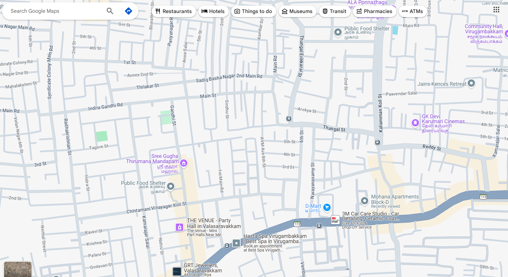

# Ex04 Places Around Me
## Date: 25/4/2025
## NAME: NITHISH .S
## REG NO.:212224240105

## AIM
To develop a website to display details about the places around my house.

## DESIGN STEPS

### STEP 1
Create a Django admin interface.

### STEP 2
Download your city map from Google.

### STEP 3
Using ```<map>``` tag name the map.

### STEP 4
Create clickable regions in the image using ```<area>``` tag.

### STEP 5
Write HTML programs for all the regions identified.

### STEP 6
Execute the programs and publish them.

## CODE
map.html
```
<html>
<head>
  <title>My City</title>
</head>
<body>
  <h1 align="center">
    <font color="red"><b>VIRUGAMBAKKAM</b></font>
  </h1>

  <h3 align="center">
    <font color="blue"><b>Nithish S</b></font>
  </h3>

  <center>
    
    <map name="MyCity">
        <area shape="rect" coords="700,150,850,650" href="theater.html" title="INOX THEATER">
        <area shape="circle" coords="570,230,45" href="road.html" title="INDRA GHANDHI ROAD">
        <area shape="circle" coords="640,200,300" href="place.html" title="STALIN GARDEN">
        <area shape="circle" coords="1120,360,100,80" href="home.html" title="HOME">
        <area shape="rect" coords="950,120,1100,140" href="food.html" title="PUBLIC FOOD SHELTER">
      </map>
  </center>
</body>
</html>
```
food.html
```
<html>
<head>
  <title>PUBLIC FOOD SHELTER</title>
</head>
<body bgcolor="blue">
  <h1 align="center">
    <font color="cyan"><b>VIRUGAMBAKKAM</b></font>
  </h1>

  <h3 align="center">
    <font color="lime"><b>PUBLIC FOOD SHELTER</b></font>
  </h3>

  <hr size="3" color="cyan">

  <p align="justify">
    <font face="Georgia" size="5" color="white">
        While the term "Public Food Shelter" isn't commonly used in Chennai,
        the city has initiatives like Amma Canteens offering subsidized meals
        to the needy at various locations. Additionally, numerous NGOs and food
        banks work to distribute food to vulnerable populations across Chennai,
        ensuring access to nourishment for those who need it most.        
  </p>
</body>
</html>
```
place.html
```
<html>
<head>
  <title>STALIN GARDEN</title>
</head>
<body bgcolor="blue">
  <h1 align="center">
    <font color="cyan"><b>VIRUGAMBAKKAM</b></font>
  </h1>

  <h3 align="center">
    <font color="lime"><b>STALIN GARDEN</b></font>
  </h3>

  <hr size="3" color="red">

  <p align="justify">
    <font face="Georgia" size="5" color="white">
        "Stalin Garden" on Arcot Road, there is a Stalin Pleasant Park in Chennai, 
        offering straightforward rooms, a restaurant, a bar, and even a spa. Alternatively, 
        you might be thinking of the recently inaugurated Kalaignar Centenary Park, a
        sprawling green space with attractions like a zipline and musical fountain. 1  
  </p>
</body>
</html>
```

road.html
```
<html>
<head>
  <title>ROAD</title>
</head>
<body bgcolor="green">
  <h1 align="center">
    <font color="gray"><b>VIRUGAMBAKKAM</b></font>
  </h1>

  <h3 align="center">
    <font color="blue"><b>INDRA GHANDHI ROAD</b></font>
  </h3>

  <hr size="3" color="red">

  <p align="justify">
    <font face="Georgia" size="5">
        Indira Gandhi Road in the Arcot Road area of Chennai is a significant stretch,
        likely featuring a mix of residential and commercial establishments. It's positioned 
        in a well-connected part of the city, offering access to various amenities and other 
        parts of Chennai.
    </font>
  </p>
</body>
</html>
```
theater.html
```
<html>
<head>
  <title>CINEMAS</title>
</head>
<body bgcolor="blue">
  <h1 align="center">
    <font color="cyan"><b>VIRUGAMBAKKAM</b></font>
  </h1>

  <h3 align="center">
    <font color="lime"><b>"INOX THEATER</b></font>
  </h3>

  <hr size="3" color="red">

  <p align="justify">
    <font face="Georgia" size="5" color="white">
        INOX is a well-known multiplex chain in India, offering a comfortable and modern movie-watching 
        experience with multiple screens in each location. You can find INOX theaters in Chennai at Phoenix
        Market City (Velachery), The Marina Mall (OMR), Chandra Metro Mall (Arcot Road), and Chennai Citi 
        Centre (Dr. RK Salai).
</body>
</html>
```

## OUTPUT



## RESULT
The program for implementing image maps using HTML is executed successfully.
